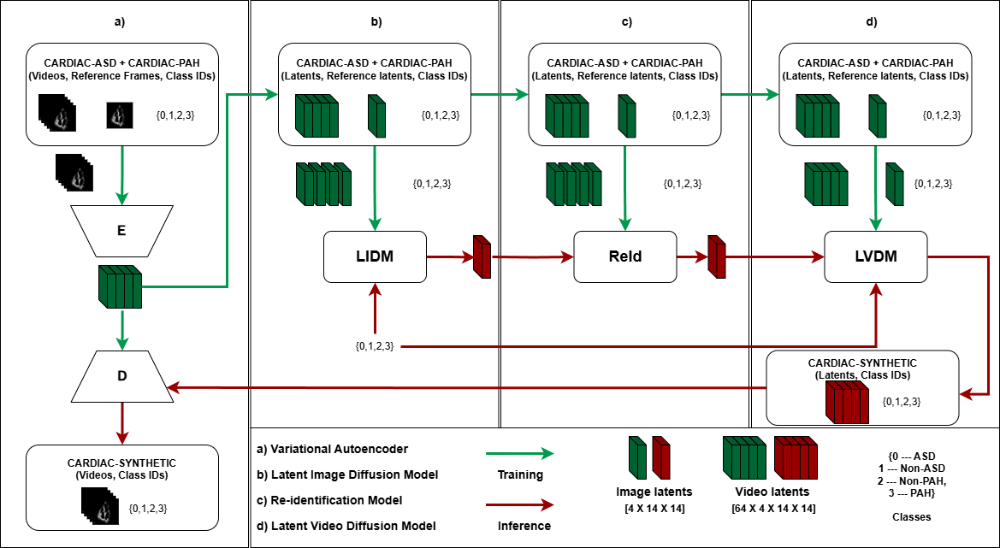

## Table of contents
- [Table of contents](#table-of-contents)
- [Environment setup](#environment-setup)
- [Data preparation](#data-preparation)
  - [➡ Original datasets](#-original-datasets)
  - [➡ Latent Video datasets for LVDM training](#-latent-video-datasets-for-lvdm-training)
  - [➡ Validation datasets](#-validation-datasets)
- [The Models](#the-models)
  - [The VAE](#the-vae)
  - [The LIDM](#the-lidm)
  - [The Re-Identification model](#the-re-identification-model)
  - [The LVDM](#the-lvdm)
  - [Structure](#structure)
- [Generating Cardiac-Synthetic](#generating-cardiac-synthetic)
- [Evaluation](#evaluation)
- [Results](#results)
- [Citation](#citation)

## Environment setup
<!-- <details open id="environment-setup">
<summary style="font-size: 1.5em; font-weight: bold;" >Environment setup<hr></summary> -->

First, we need to set up the environment. We use the following command to create a new conda environment with the required dependencies.

```bash
conda create -y -n echodream python=3.11
conda activate echodream
pip install -e .
```
*Note: the exact version of each package can be found in requirements.txt if necessary*

This repository is largely adapted from the [Echonet-synthetic repository](https://huggingface.co/HReynaud/EchoNet-Synthetic). i.e.
- The Variational Auto-Encoder (VAE) is used as is from the repo.

We also rely on external libraries to:
- evaluate the generated images and videos (StyleGAN-V)

How to install the external libraries is explained in the [External libraries](external/README.md) section.

<!-- </details> -->

## Data preparation
<!-- <details open id="data-preparation">
<summary style="font-size: 1.5em; font-weight: bold;">Data preparation<hr></summary> -->

### ➡ Original datasets
Download the CardiacNet data from [here](https://www.kaggle.com/datasets/xiaoweixumedicalai/abnormcardiacechovideos). The dataset is available for free upon request. Once downloaded, extract the content of the archive in the `datasets` folder. For simplicity and consistency, we structure the data like so:
```
datasets
└── CardiacNet
    ├── Videos
    └── FileList.csv
```
We restructured the CardiacNet dataset to include a 'Videos' directory as well as a 'FileList.csv' file. This is done with the following commands:

```bash
python scripts/1process_cardiacnetdata.py \
	--folder_path ./CardiacNet/ \
	--output_format mp4 \
	--fps 32 \
	--resize 112,112

mkdir -p ./datasets/CardiacNet/ 
mv -r ./CardiacNet/Videos ./datasets/CardiacNet/Videos 
cp  ./CardiacNet/FileList.csv ./datasets/CardiacNet/FileList.csv

python scripts/2split_and_update_filelist.py \
	--csv_path ./datasets/CardiacNet/FileList.csv
```
This is crucial for the other scripts to work properly.

### ➡ Latent Video datasets for LVDM training

The LVDM is trained on pre-encoded latent representations of the videos. To encode the videos, we use the image VAE. You can either retrain the VAE or download it from [here](https://huggingface.co/HReynaud/EchoNet-Synthetic/tree/main/vae). Once you have the VAE, you can encode the videos with the following command:

```bash
python scripts/5encode_video_dataset.py \
    --model models/vae \
    --input datasets/CardiacNet \
    --output data/latents/cardiacnet \
    --gray_scale
```

### ➡ Validation datasets

To quantitatively evaluate the quality of the generated images and videos, we use the StyleGAN-V repo. We cover the evaluation process in the [Evaluation](#evaluation) section. To enable this evaluation, we need to prepare the validation datasets. We do that with the following command:

```bash
python scripts/4create_reference_dataset.py --dataset datasets/CardiacNet --output data/reference/cardiacnet --frames 16
```

Note that the CardiacNet dataset does not support 128 frames, preventing the computation of FVD_128, because there are not enough videos lasting more 4 seconds or more. We therefore only extract 16 frames per video for these datasets.

Finally, we convert the CardiacNet videos to images to enable downstream classification:

```bash
python scripts/6video_to_jpg.py \
	--video_folder ./datasets/CardiacNet/Videos \
	--output_folder ./datasets/CardiacNet/jpg
```
</details>

## The Models
<!-- <details open id="models">
<summary style="font-size: 1.5em; font-weight: bold;">The models<hr></summary> -->



*Our pipeline, using our models: LIDM, Re-Identification (Privacy), LVDM and VAE*


### The VAE

You can download the pretrained VAE from [here](https://huggingface.co/HReynaud/EchoNet-Synthetic/tree/main/vae)

### The LIDM

You can download the pretrained LIDM from [here](https://xx) or train it yourself by following the instructions in the [LIDM training](echo/lidm/README.md) section.

### The Re-Identification model

You can download the pretrained Re-Identification models from [here](https://xx) or train it yourself by following the instructions in the [Re-Identification training](echo/privacy/README.md) section.

### The LVDM

You can download the pretrained LVDMS from [here](https://xx) or train it yourself by following the instructions in the [LVDM training](echo/lvdm/README.md) section.

### Structure

The models should be structured as follows:
```
models
├── classification
├── lidm_cardiacnet
├── lvdm_cardiacnet
├── reidentification_cardiacnet
└── vae
```

<!-- </details> -->
## Generating Cardiac-Synthetic
<!-- <details open id="cardiac-synthetic">
<summary style="font-size: 1.5em; font-weight: bold;">Generating Cardiac-Synthetic<hr></summary> -->

Now that we have all the necessary models, we can generate the synthetic dataset following the steps below:
- Generate a collection of latent heart images with the LIDM (usually 2x the amount of videos we are targetting)
- Apply the privacy check, which will filter out some of the latent images
- Generate the videos with the LVDM, and decode them with the VAE
```bash
CUDA_VISIBLE_DEVICES='0' python -m echo.lidm.sample  \
	--config echo/lidm/configs/cardiacnet.yaml   \
	--unet models/lidm_cardiacnet   \
	--vae models/vae   \
	--output samples/lidm_cardiacnet  \
	--num_samples 2000    \
	--batch_size 256    \
	--num_steps 256     \
	--save_latent   \
	--sampling_mode diffusion \
	--conditioning_type class_id \
	--class_ids 4 \
    --condition_guidance_scale 5.0 \
    --seed 0
```

Then, we filter the latent images with the re-identification model:
```bash
python -m echo.privacy.apply  \
    --model models/reidentification_cardiacnet   \
    --synthetic samples/lidm_cardiacnet/latents  \
    --reference data/latents/cardiacnet    \
    --output samples/lidm_cardiacnet/privacy_compliant_latents
```

We generate the synthetic videos with the LVDM:
```bash
CUDA_VISIBLE_DEVICES='0' python -m echo.lvdm.sample  \
    --config echo/lvdm/configs/cardiacnet.yaml   \
    --unet models/lvdm_cardiacnet  \
    --vae Echodream/models/vae   \
    --conditioning samples/lidm_cardiacnet/privacy_compliant_latents  \
    --output samples/lvdm_cardiacnet  \
    --num_samples 655    \
    --batch_size 24    \
    --num_steps 256     \
    --save_as mp4,jpg    \
    --frames 192 \
    --sampling_mode diffusion \
    --conditioning_type csv  \
    --condition_guidance_scale 5 \
    --frame_guidance_scale 1  \
    --use_separate_guidance
```

Finally, we prepare the synthetic data for downstream evaluation
```bash
mkdir -p ./datasets/Cardiac-synthetic/
cp -r ./samples/lvdm_cardiacnet/jpg  ./datasets/Cardiac-synthetic/jpg
cp ./samples/lvdm_cardiacnet/FileList.csv ./datasets/Cardiac-synthetic/FileList.csv

python scripts/update_split_filelist.py --csv ./datasets/Cardiac-synthetic/FileList.csv
 	--train 457 
	--val 97 
	--test 101

python scripts/update_synt_file.py 
	--input ./datasets/Cardiac-synthetic/FileList.csv 
	--output ./datasets/Cardiac-synthetic/FileList.csv
```

<!-- </details> -->

## Evaluation
<!-- <details open id="evaluation">
<summary style="font-size: 1.5em; font-weight: bold;">Evaluation<hr></summary> -->
As the final step, we evaluate the quality of Cardiac-Synthetic videos by training two binary classification models on the synthetic data and evaluating it on the real data. To do so, follow the instructions [here](echo/classification/README.md).

</details>

## Results
<!-- <details open id="results">
<summary style="font-size: 1.5em; font-weight: bold;">Results<hr></summary> -->

<!-- <p>Here is a side by side comparison between a real and a synthetic video.</p>

<table style="width:auto; border:1px solid black; text-align:center;">
    <tr>
        <th style="padding:10px; border:1px solid black;">Real Video</th>
        <th style="padding:10px; border:1px solid black;">Reproduction</th>
    </tr>
    <tr>
        <td style="padding:10px; border:1px solid black;"></td>
        <td style="padding:10px; border:1px solid black;"></td>
    </tr>
</table> -->

<p>Here we show a collection of synthetic videos from Cardiac-Synthetic.</p>


<!-- </details> -->

<!-- ## Citation -->
## Citation

```
@inproceedings{xx}
```
